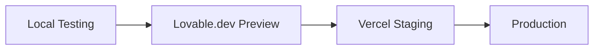

# 🧾 Accounting

**Modern accounting SaaS built with cutting-edge stack for SMBs**  
[](https://nextjs.org/)
[](https://supabase.com/)
[](https://rollbox-accounting.vercel.app)

<div align="center">
  
</div>

## ✨ Features

- **Real-time financial tracking**
- Automated invoice generation
- Multi-company support
- Role-based access control
- Responsive mobile UI
- Secure end-to-end encryption

## 🚀 Tech Stack

| Layer               | Technology                           |
|---------------------|--------------------------------------|
| **Frontend**        | Next.js 14 (App Router)              |
| **Styling**         | Tailwind CSS + Shadcn UI             |
| **State Management**| Zustand                              |
| **Backend**         | Supabase (PostgreSQL + Auth)         |
| **Forms**           | React Hook Form + Zod validation     |
| **Deployment**      | Vercel + Lovable.dev (previews)      |

## ⚙️ Setup Local Development

### Prerequisites
- Node.js 18+
- PNPM 8.x
- Supabase account

### Installation
```bash
# Clone repository
git clone https://github.com/hubrollbox/rollbox-accounting.git
cd rollbox-accounting

# Install dependencies
pnpm install

# Setup environment variables
cp .env.example .env.local
```

### Configure Environment
```env
# .env.local
NEXT_PUBLIC_SUPABASE_URL=https://your-project.supabase.co
NEXT_PUBLIC_SUPABASE_ANON_KEY=your-anon-key
```

### Run Development Server
```bash
pnpm dev
```
Open http://localhost:3000

## 📦 Production Build
```bash
pnpm build
pnpm start
```

## 🔒 Supabase Configuration
1. Create new project at [Supabase](https://supabase.com)
2. Enable Row Level Security (RLS) for all tables
3. Configure email templates in Auth settings
4. Set up storage buckets for document uploads

## 🌐 Deployment

### Vercel (Production)
[](https://vercel.com/new/clone?repository-url=https%3A%2F%2Fgithub.com%2Fhubrollbox%2Frollbox-accounting)

### Lovable.dev (Previews)
1. Connect GitHub repository
2. Enable automatic previews for PRs
3. Set environment variables:
   ```env
   NEXT_PUBLIC_SUPABASE_URL=https://your-staging-supabase.supabase.co
   NEXT_PUBLIC_SUPABASE_ANON_KEY=your-staging-key
   ```

## 🧪 Testing Strategy


### Manual Tests Required
- **Authentication Flow**
  - [ ] New user registration
  - [ ] Password recovery
  - [ ] Multi-device logout
- **Data Integrity**
  - [ ] Invoice number sequencing
  - [ ] Financial report consistency
- **Mobile UX**
  - [ ] Form submissions on <400px screens
  - [ ] Table scrolling experience

## 🛠 Troubleshooting

| Issue                          | Solution                          |
|--------------------------------|-----------------------------------|
| Auth redirect failures         | Check callback URLs in Supabase   |
| Database connection errors     | Verify RLS policies              |
| UI rendering issues            | Run `pnpm dlx shadcn-ui@latest init` |
| Missing styles                | Purge Tailwind config            |

## 🤝 Contributing

1. Fork the repository
2. Create feature branch (`feat/your-feature`)
3. Commit changes with semantic messages
4. Open PR with detailed description
5. Await Lovable.dev preview deployment

```bash
# Commit message format
feat: add invoice export functionality
fix(responsive): mobile table scrolling
```

## 📄 License
MIT License - see [LICENSE](https://github.com/hubrollbox/rollbox-accounting/blob/main/LICENSE) for details
