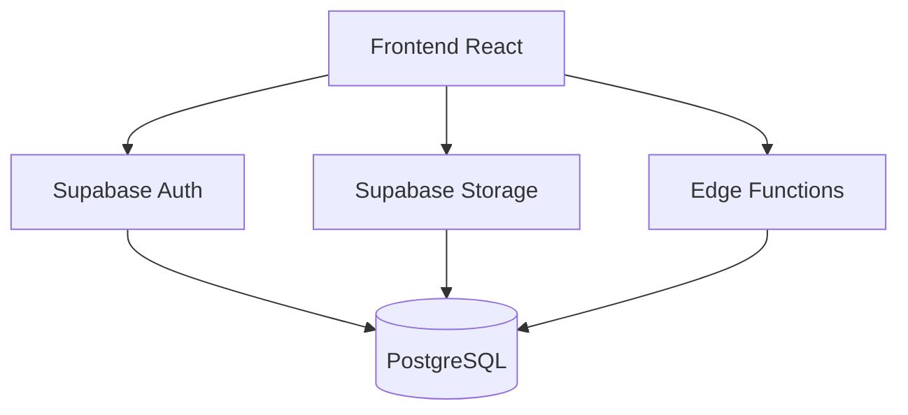
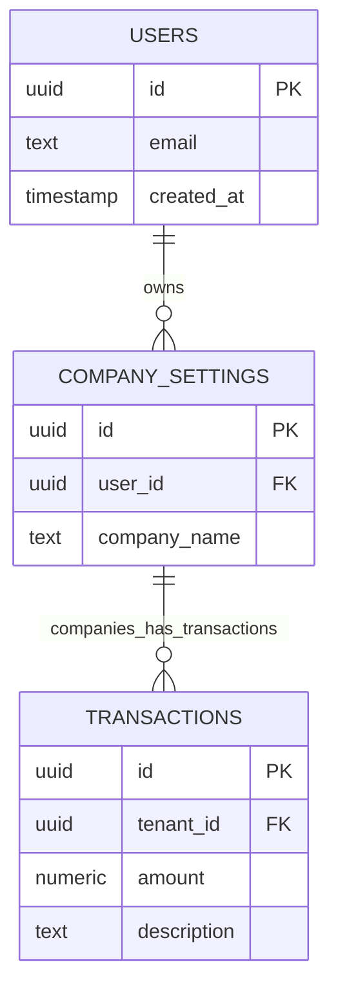

## Arquitetura Supabase



## Políticas RLS Exemplo

```sql
-- Acesso multi-tenant
CREATE POLICY "Tenant data access"
ON transactions
FOR ALL
USING (tenant_id IN (
  SELECT id FROM company_settings 
  WHERE user_id = auth.uid()
));
```

## Fluxo de Upload de Documentos

1. Usuário seleciona arquivo  
2. Sistema utiliza utilitário para montar bucket `tenant-{id}-documents`  
3. Arquivo salvo no bucket referente ao tenant  
4. (Extra) Metadata do arquivo pode ser registrada no PostgreSQL

## Modelo de Dados Simplificado



## Fluxo Multi-tenant Storage

- Cada tenant possui bucket único `tenant-{tenantId}-documents`.
- Interface exibe botão de envio de arquivo, com feedback visual.
- Segurança provida por políticas RLS e configuração de buckets restritos.

## Observações

- Buckets precisam ser criados previamente (pelo admin ou via função edge).
- Recomenda-se auditar uploads registrando metadados na base (opcional).
- Formulários críticos validados com Zod para robustez e experiência.

